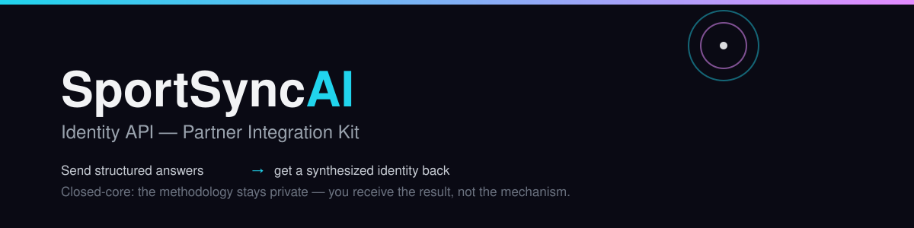
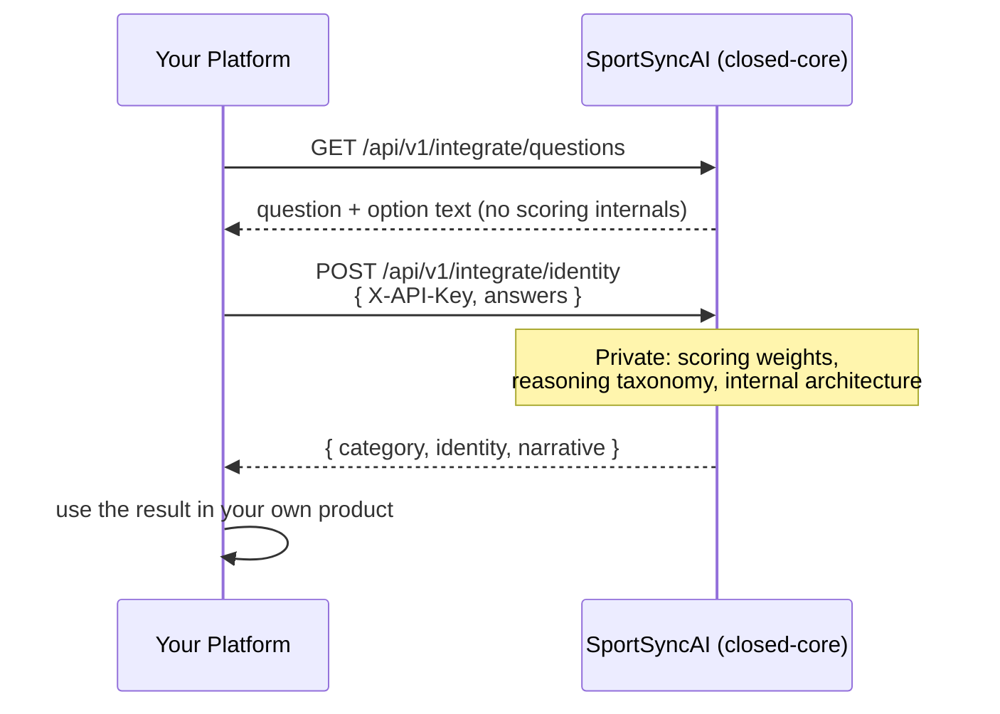

<p align="center">
  
</p>

<p align="center">
  <b>Send structured answers about a person. Get back a synthesized identity read. Nothing else.</b>
</p>

---

This is **public developer integration documentation** for SportSyncAI's Identity API — not source code, and not an open-source release of SportSyncAI. **SportSyncAI's core implementation and intelligence remain proprietary.** What's here is everything a developer needs to integrate against the live HTTPS API: the contract, a runnable example, and nothing else.

**New to this?** Start with **[What the Identity API enables](docs/WHAT_IT_ENABLES.md)** — what it does for your product, what you're not taking on, and where its limits honestly are. Then come back here for the integration.

## How it fits together



Everything inside the "SportSyncAI" box in that diagram is private. Everything crossing the arrows is the entire integration surface — there is nothing else.

## Quickstart — run the real example, on any device

You need Docker and one API key (see [Getting a key](#getting-a-key)). Nothing else — no Python, no Node, no local setup.

```bash
cd examples
docker build -t sportsyncai-example .
docker run --rm -e SPORTSYNCAI_API_KEY=<your key> sportsyncai-example
```

That's it. The container calls the real, live, hosted API — the exact same two endpoints your own integration will use — and prints the result:

```
1. Fetching the question catalog from https://sportsyncai.site ...
   Got 31 questions.
   Using: "You've got a challenge in front of you, and the prize is the same
           no matter what you pick. Which one do you choose?"
   Answering: "A mental puzzle — I solve it just by thinking"

2. Sending the answer to POST /api/v1/integrate/identity ...
   HTTP 200

{
  "success": true,
  "category": "mental",
  "category_secondary": null,
  "identity": "The Strategist",
  "narrative": "You win in your head before your body moves. The real
                game is the one no one else can see."
}
```

*(This is a real, live run of this exact example against production — not a mockup.)*

### Without Docker

If you'd rather run it directly (only needs Python 3, no dependencies beyond the standard library):

```bash
SPORTSYNCAI_API_KEY=<your key> python3 examples/example.py
```

## What's in this repository

| Path | Purpose |
|---|---|
| `docs/WHAT_IT_ENABLES.md` | What integrating this does for your business, what you don't have to build, and what it deliberately doesn't do. |
| `docs/API_REFERENCE.md` | The complete contract — every field, every error code, request-size limits, rate limits. |
| `examples/example.py` | The entire integration in ~50 lines. Calls the two real endpoints over HTTPS. Read it end to end; it's short on purpose. |
| `examples/Dockerfile` | Wraps `example.py` so it runs identically on any OS with zero local setup. |
| `assets/banner.svg` | This page's banner. |

## Getting a key

API keys are issued individually. **Email [partners@sportsyncai.site](mailto:partners@sportsyncai.site) to request one.**

Send the key in the `X-API-Key` header; it identifies your integration, not a person, and is separate from any SportSyncAI end-user login.

## What you will never receive

Per-answer scoring weights, the internal reasoning taxonomy, any trace of the reasoning process, internal record identifiers, or anything about SportSyncAI's architecture. The response you get back — category, identity, narrative — is the complete, final answer. There is no "more detail" endpoint, because there is nothing more to hand over.

## Licensing

No open-source license is granted. This repository is public developer documentation and integration examples; SportSyncAI's implementation and intelligence remain proprietary. The example code here is provided for building an integration against the documented API. Questions: [partners@sportsyncai.site](mailto:partners@sportsyncai.site).
